# Raytracer Documentation

This project is our implementation of a raytracer developed in C++. It allows you to render 3D scenes defined in a configuration file. The raytracer can be extended by adding more plugins.

*Please refer to the following pages firsthand for basic installation and usage purposes:*
- [Installation](./documentation/install.md)
- [Usage](./documentation/usage.md)

Contribution graph of the project:


## Sommaire

- [Introduction](#introduction)
  - [Objectif](#objectifs-du-projet)
  - [Fonctionnement Général](#fonctionnement-général)
- [Base Technique du raytracer](#base-technique-du-raytracer)
  - [Fonctionnement des Plugins](#fonctionnement-des-plugins)
  - [Fonctions Nécessaires](#fonctions-nécessaires)
- [Compatibilité](#compatibilité)
  - [Production d'un fichier de configuration compatible](#production-d'une-configuration-compatible)
- [Exemples](#exemples)

## Introduction

### Objectifs du Projet

Le projet Raytracer d'Epitech pour B-OOP-400 vise à développer et améliorer les compétences clés des étudiants dans les domaines suivants :

1. **OOP Avancée en C++** : Appliquer les principes de la programmation orientée objet pour structurer et gérer des systèmes logiciels complexes.

2. **Design Patterns** : Mettre en œuvre au moins deux design patterns pour résoudre des problèmes de design logiciel courants, améliorant la modularité et la maintenabilité du code.

3. **Maîtrise du C++** : Approfondir la compréhension du C++ et de sa bibliothèque standard à travers une application pratique.

4. **Fondamentaux de Graphisme Informatique** : Acquérir une expérience pratique des techniques de ray tracing, y compris le rendu de primitives géométriques, l'éclairage et les matériaux.

5. **Architecture Logicielle** : Apprendre à concevoir des systèmes flexibles et extensibles en utilisant des interfaces et des bibliothèques dynamiques.

6. **Techniques d'Optimisation** : Explorer des optimisations de performance telles que le multithreading et le clustering réseau avec la division des calculs.

### Fonctionnement Général

1. **Création d'un fichier de configuration** : l'utilisateur doit écrire ou utiliser des intelligences artificielles pour l'assister dans la création d'un fichier de configuration qui sera traité par le programme.

2. **Interprétation du fichier de configuration** : le programme va s'exécuter en tentant de tirer le maximum des ressources physiques du système pour produire un rendu le plus rapidement possible. Il possède une fonctionnalité de clustering qui peut permettre à plusieurs ordinateurs de travailler ensemble pour rendre une même image (cf __./documentation/usage.md__)

3. **Affichage du rendu et enregistrement** : une fois le rendu achevé, le programme va afficher à l'utilisateur l'image et la stocker au format PPM à la racine du projet.

## Base Technique du Raytracer

### Fonctionnement des plugins

Il est possible à l'utilisateur de coder et d'ajouter ses propres plugins pour personnaliser ses matériaux, sa lumière, des caméras, des primitives etc.
Le programme fait usage d'un builder et d'une factory pour utiliser les plugins compilés en shared objects (.so), les fichiers sont ouverts et interprétés par le programme pour créer des INodes de types associés qui héritent des classes souhaitées afin de les intégrer à une scène qui est en réalité une sorte d'arbre de noeuds qui peuvent prendre toutes sortes de types et qui héritent de certaines propriétés des noeuds parents.

<p float="left">
  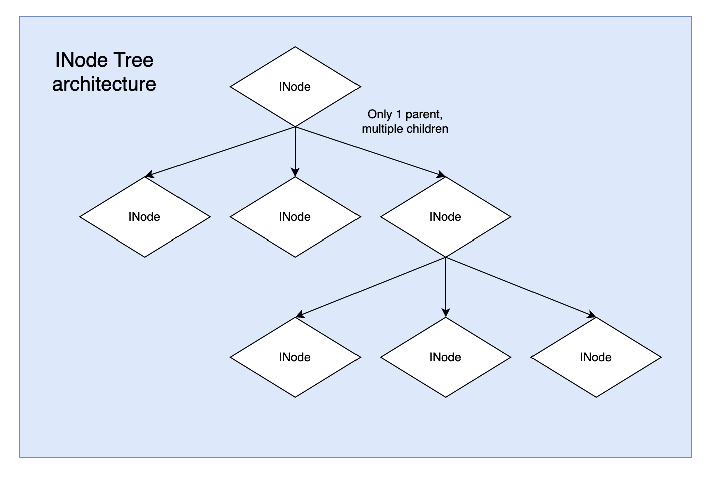
  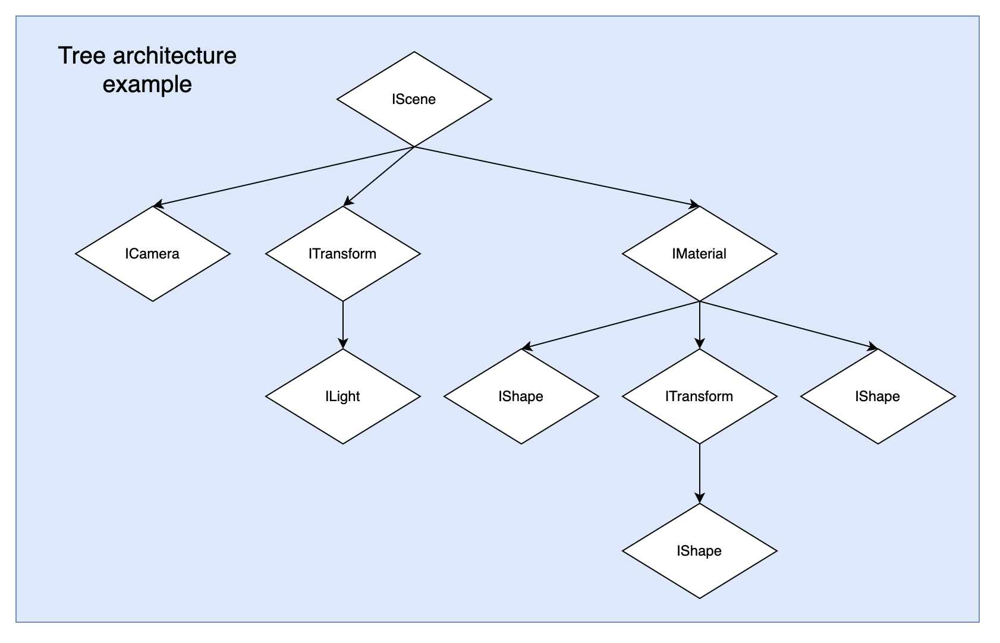 
</p>
<p align="center">
  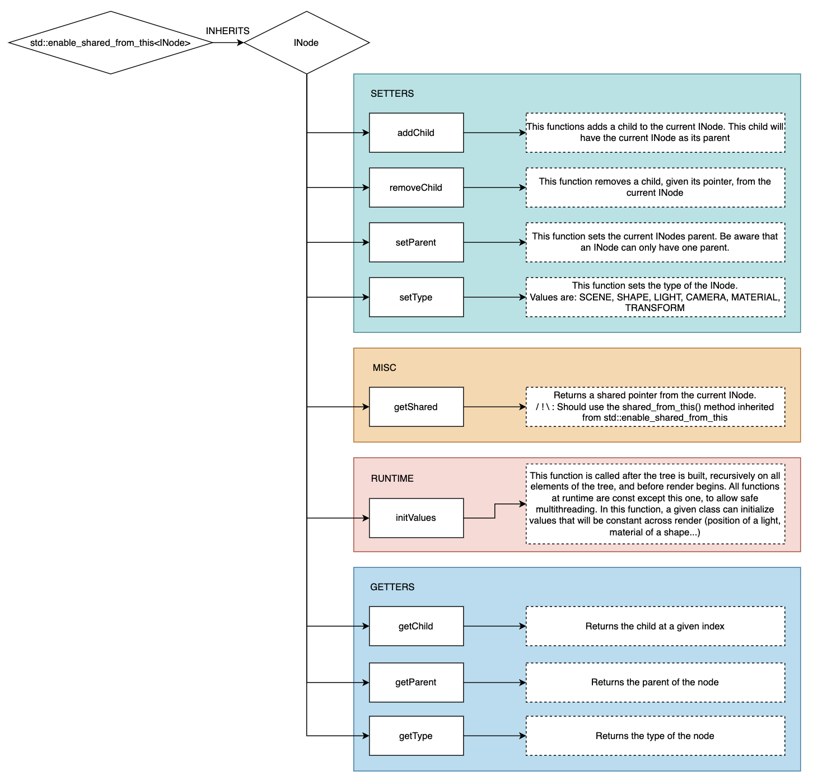
</p>

### Fonctions Nécessaires

Il est requis pour le bon fonctionnement d'un nouveau plugin que celui-ci possède au moins une fonction "create" qui a pour prototype le suivant :

```cpp
extern "C" ray::INode *create(const std::map<std::string, std::string> &attributes);
```

Où le contenu d'*attributes* représente les différentes propriétés du fichier de configuration et les valeurs associées à utiliser lors de la création du node (Par exemple la couleur de base d'un objet, sa transformation ou rotation, etc).

Pour les Nodes des différents types et leurs fonctions personnelles à implémenter, veuillez vous référer aux interfaces associées dans les fichiers (IMaterial, IShape, ILight, etc) ou bien aux schémas explicatifs des différentes interfaces ci-dessous.

__IScene et IMaterial :__
<p float="left">
  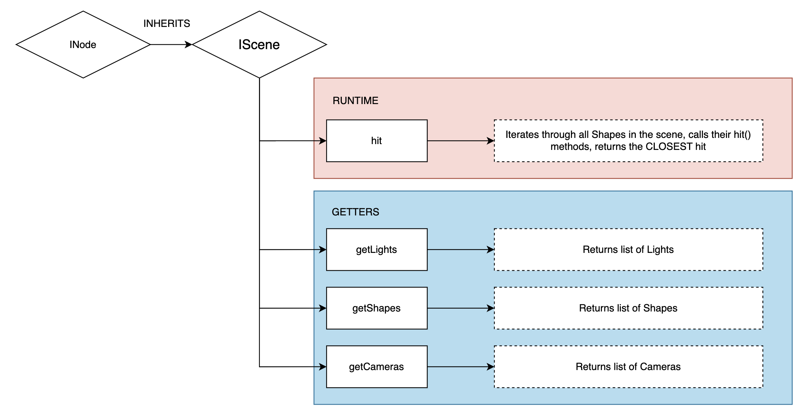
  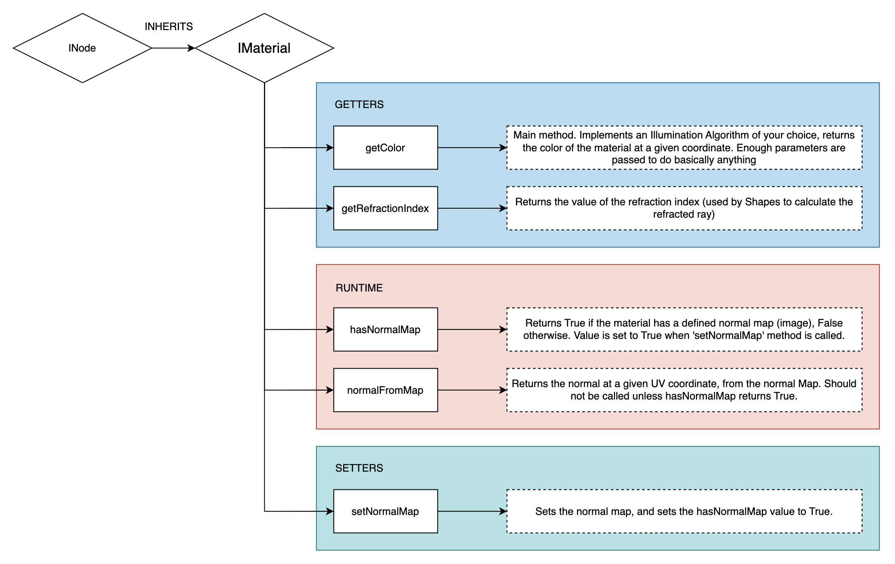 
</p>

__ILight et IShape :__
<p float="left">
  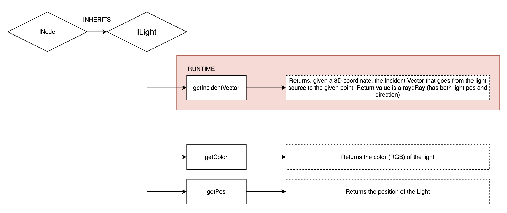
  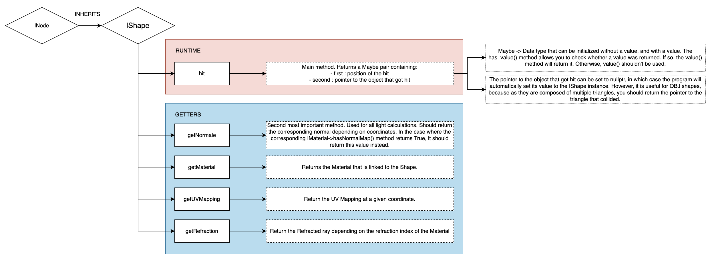 
</p>

__ICamera et ITransform :__
<p float="left">
  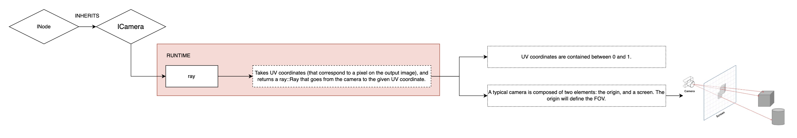
  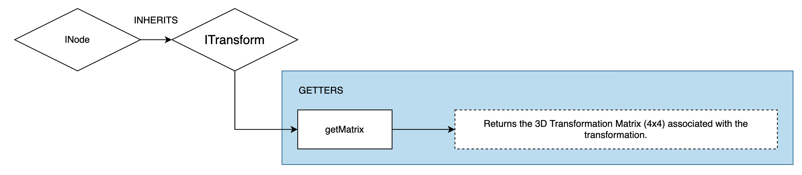 
</p>

## Compatibilité

### Production d'une Configuration compatible

Le programme utilise la librairie C++ "libconfig" (voir plus d'informations dans ./documentation/install.md), la synthaxe du fichier doit rigoureusement respecter les standards de la librairie.

Pour avoir un fichier de configuration complet, il faut implémenter les parts :

-**nodes** : qui doit contenir l'`id`, le `type` et les `propriétés` de chaque node. Le **type** fait référence au plugin .so depuis lequel le node sera construit.

-**config** : qui représente la hiérarchie des nodes et qui donne les liens de parentée entre les différents nodes dans la scène. Elle doit contenir l'`id` et les `children` de chaque node.

-**background** : permet de spécifier la couleur du fond en cas d'absence de skybox ou d'absence de contact avec une primitive. Il doit contenir les éléments `r`, `g` et `b` avec une valeur entre 0 et 255 (compris).

-**image** : permet de spécifier le nom du fichier de sortie ainsi que sa taille et sa définition. L'élement image doit contenir les attributs `file` pour le nom du fichier, `width` et `height` pour sa taille (en pixels).

## Exemples :

*Des fichiers de configurations sont disponibles dans le dossier "config_files" à des fins de test.*

Les possibilités du Raytracer sont infinies mais voici quelques exemples rendus avec le programme :

<p float="left">
  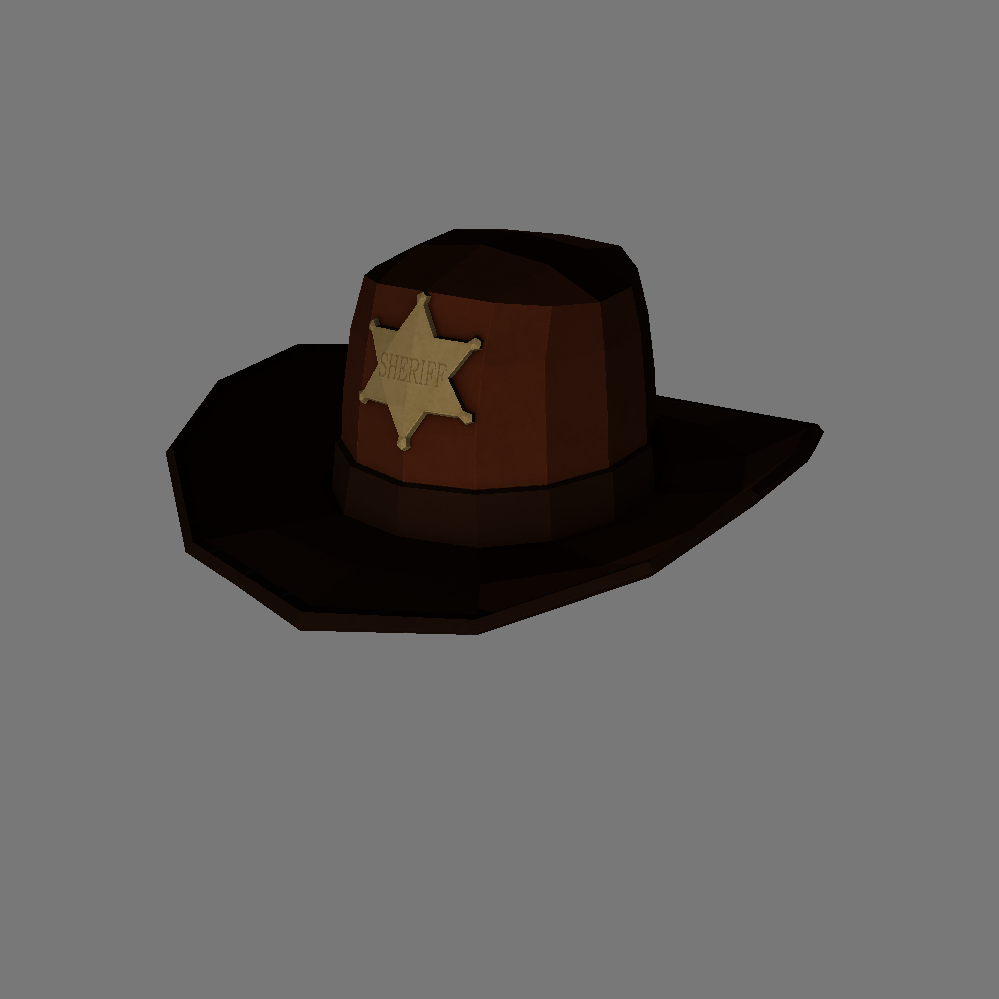
  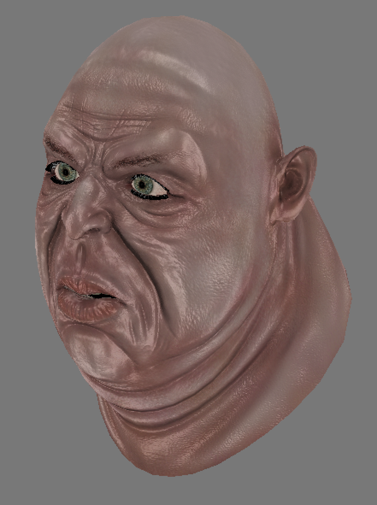 
</p>
<p float="left">
  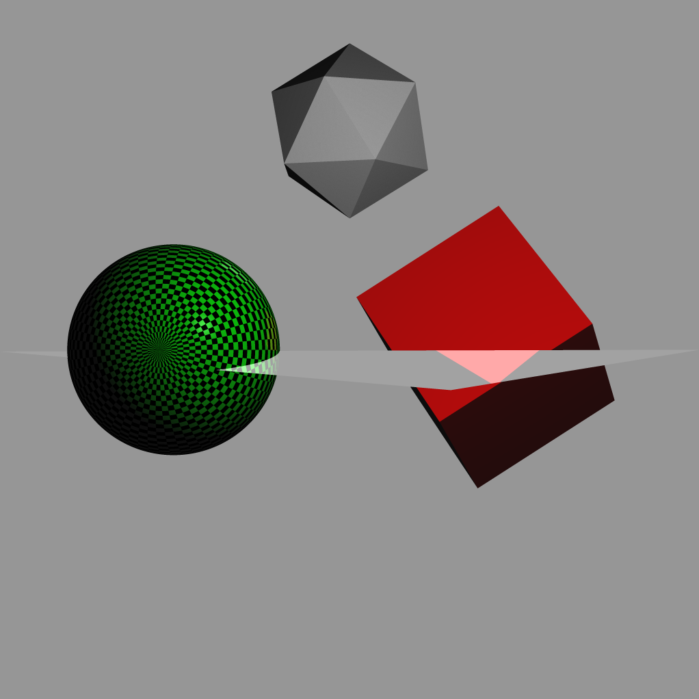
  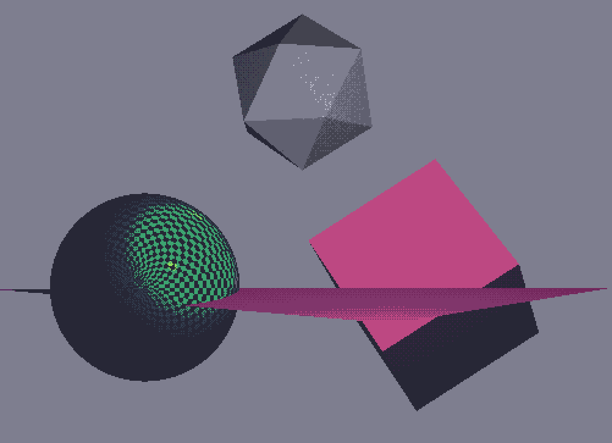 
</p>
<p float="left">
  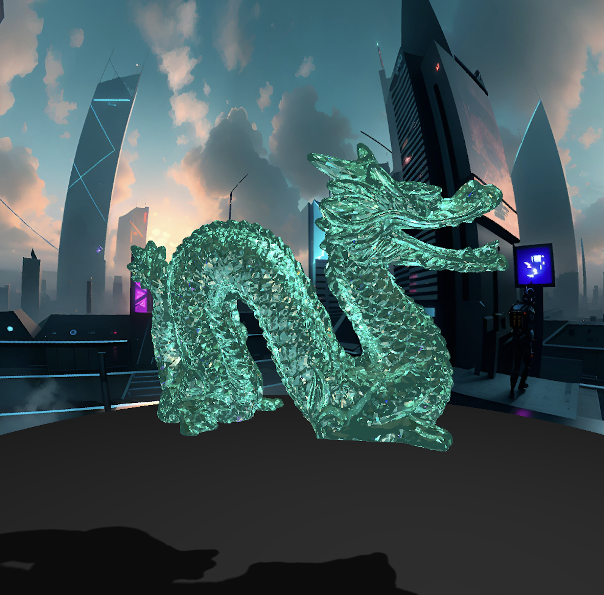
  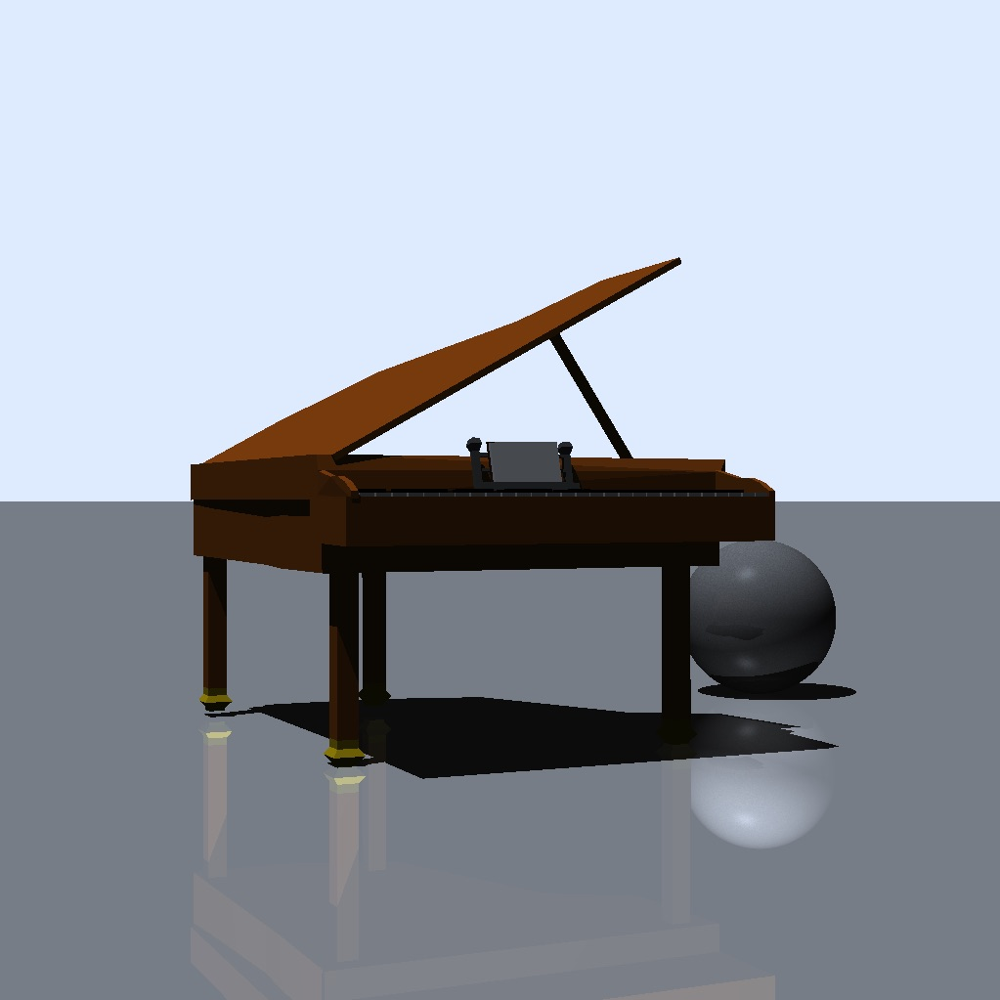
</p>


